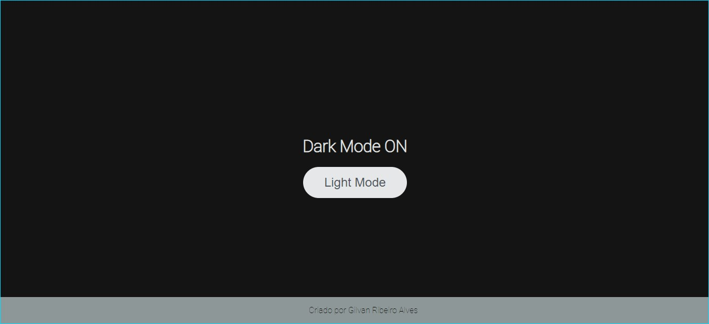

<h1 align="center">
   Dark-Mode_JavaScript
</h1>

Projeto criado com a tutoria da Sthephany Nusch da Digital Innovation One.  
Ele consiste de uma página com recursos para mudança do tema.   
Com a combinação de **HTML**, **JavaScript** e **CSS** o usuário pode optar por um dos 2 temas disponíveis:   

## Tema Claro

  

## Tema Escuro

